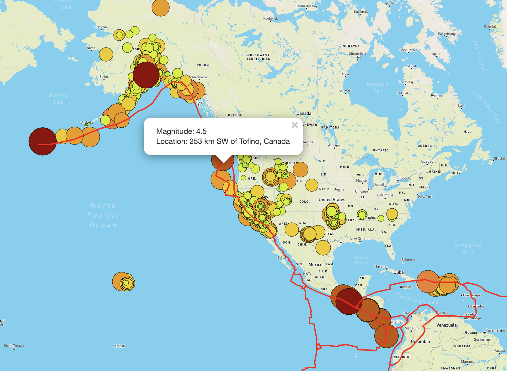

# Mapping_Earthquakes
JavaScript and HTML files to produce Mapbox maps using Leaflet of cities,
airports, airline routes, and earthquakes from local JSON/JavaScript files and
API calls to USGS GeoJSON sources.

## Resources
- Data Source:
    - [USGS All Earthquakes (Past 7 Days)](https://earthquake.usgs.gov/earthquakes/feed/v1.0/summary/all_week.geojson)
    - [Tectonic Plates](https://raw.githubusercontent.com/fraxen/tectonicplates/master/GeoJSON/PB2002_boundaries.json)
    - [USGS M4.5+ Earthquakes (Past 7 Days)](https://earthquake.usgs.gov/earthquakes/feed/v1.0/summary/4.5_week.geojson)
    - [Toronto Airline Routes](torontoRoutes.json)
    - [Major Airports](majorAirports.json)
    - [Toronto Neighborhoods](torontoNeighborhoods.json)
    - [City Populations](Mapping_Multiple_Points/static/js/cities.js)
- Software:
    - Leaflet 1.7.1
    - D3.js 5.16.0
    - Mapbox
    - Python 3.8.3
    - Visual Studio Code 1.51.1

## Usage
This repository contains multiple JavaScript/HTML packages, each producing
an interactive map. One can launch the earthquake and tectonic plate map as
follows:

Navigate to `Earthquake_Challenge` directory:
```
$ cd Earthquake_Challenge/
```
Launch the Python `http.server` module:
```
$ python -m http.server
Serving HTTP on :: port 8000 (http://[::]:8000/) ...
```
Launch web browser to the local host and port shown in the output above. Hover
cursor over tile in top right corner to change the background map and toggle
overlays on/off:


Select a marker to display earthquake magnitude and location:



Use `CTRL+C` to shut down the HTTP server after closing the browser.

One can follow this same process within any of the directories contained in
the root of this repository to launch other maps from the resources listed
above. Ensure the current working directory contains an `index.html` file and
`static` directory of JavaScript code prior to starting the `http.server`
module.
